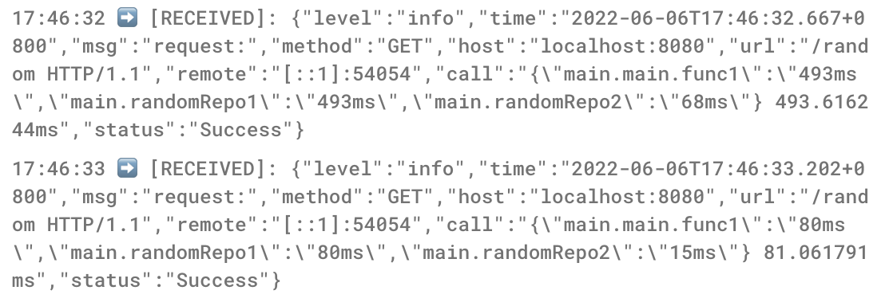

  <pre style="float:left;">
                                      _ .-') _                             
                                     ( (  OO) )                            
 ,--.       .-'),-----.   ,----.      \     .'_   .-'),-----.   ,----.     
 |  |.-')  ( OO'  .-.  ' '  .-./-')   ,`'--..._) ( OO'  .-.  ' '  .-./-')  
 |  | OO ) /   |  | |  | |  |_( O- )  |  |  \  ' /   |  | |  | |  |_( O- ) 
 |  |`-' | \_) |  |\|  | |  | .--, \  |  |   ' | \_) |  |\|  | |  | .--, \ 
(|  '---.'   \ |  | |  |(|  | '. (_/  |  |   / :   \ |  | |  |(|  | '. (_/ 
 |      |     `'  '-'  ' |  '--'  |   |  '--'  /    `'  '-'  ' |  '--'  |  
 `------'       `-----'   `------'    `-------'       `-----'   `------'   
  </pre>

方便地<em>LogDog</em> 日志实时查看工具
  

 

## 背景

在微服务架构中，需要将各个服务的日志进行收集，但是事实标准EFK中的elasticsearch以及kibana，对于大多数场景以及功能溢出，而且消耗太多资源

logdog为简单的日志实时查看工具，将其运行于fluentd容器里面，fluentd接收微服务中所有的日志完成聚合

logdog就能在fluentd里直接查看当前所有微服务链路中的日志

## 特性

- 🗂 低资源占用
- 📦 实时查看日志

## 使用手册

### 使用

在fluentd部署容器时添加logdog的release版本并运行

微服务使用日志的时候通过`wwqdrh/logger`快速的配置将日志输出到fluentd中

实时日志查看: http://localhost:8080/log/data?file=log.txt

在对应的log.txt新建日志记录查看效果

